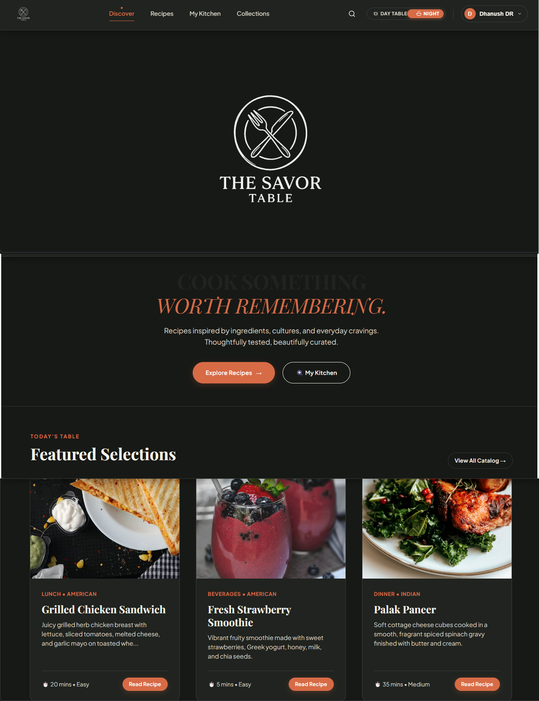
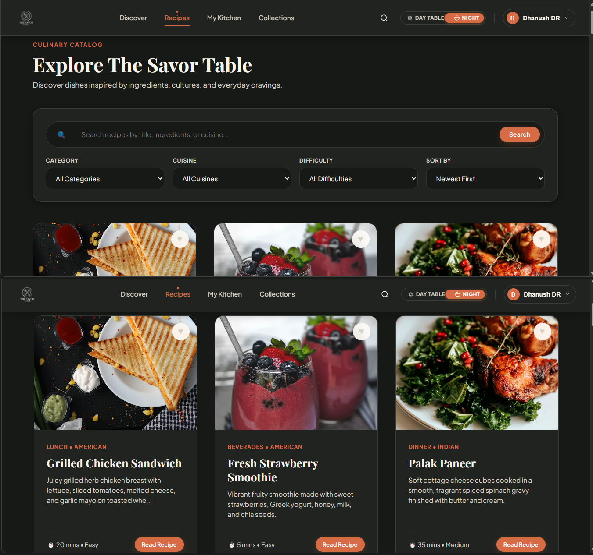
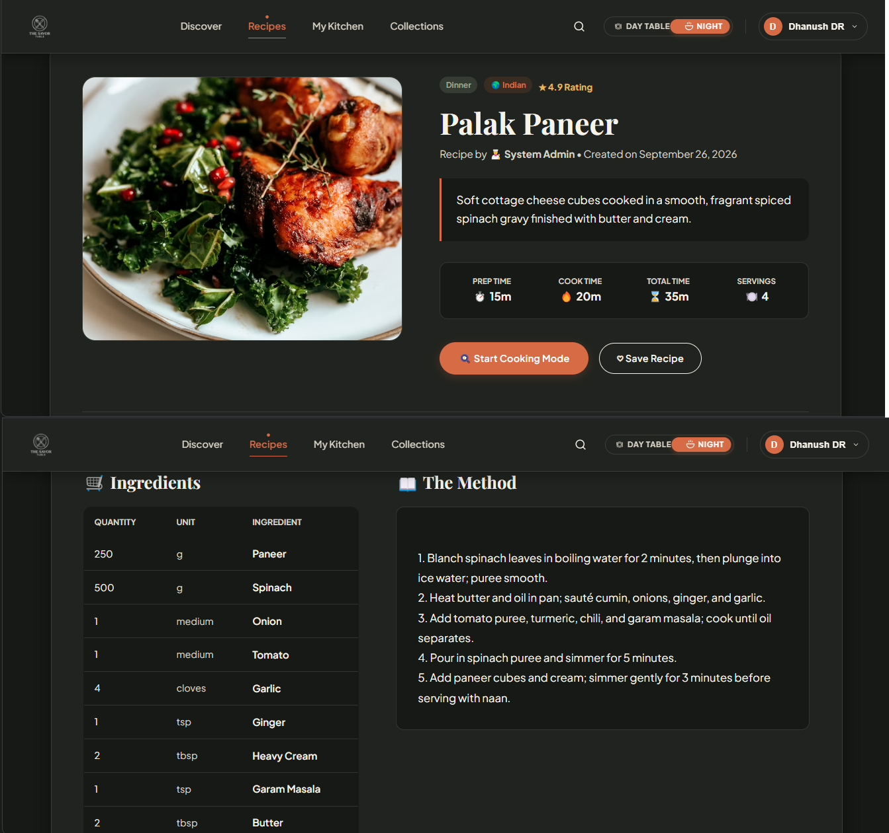
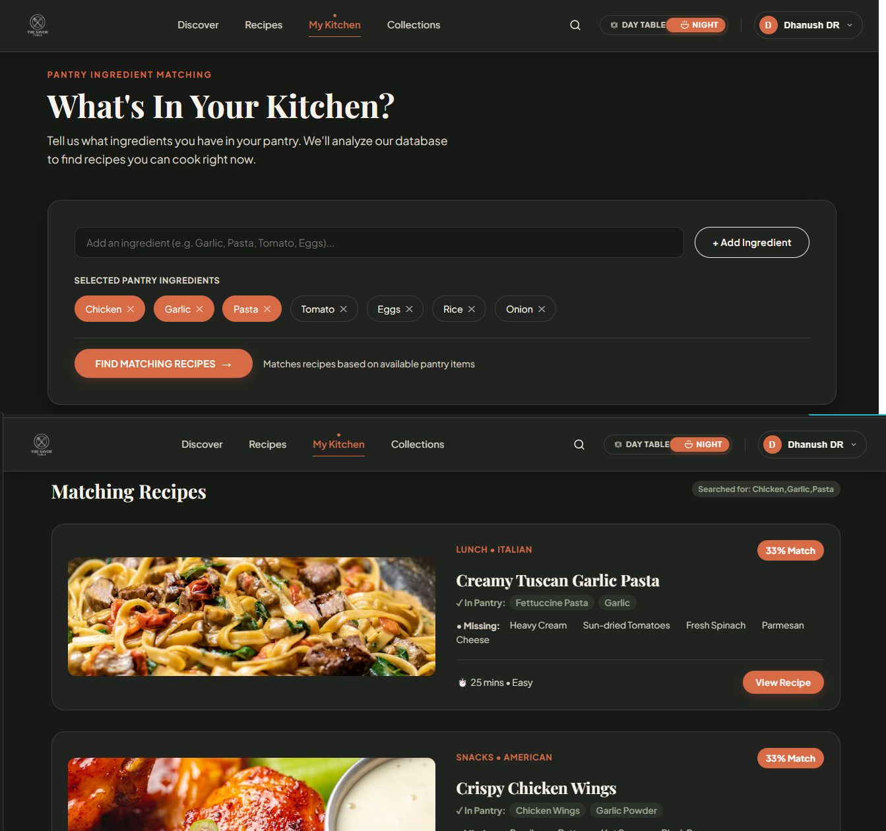
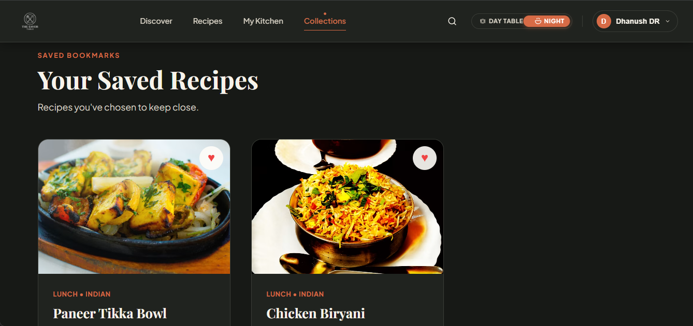
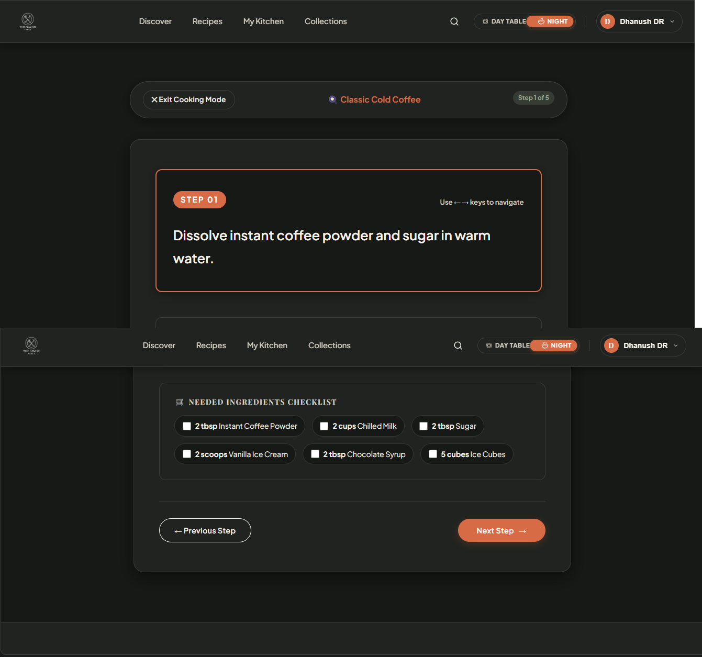
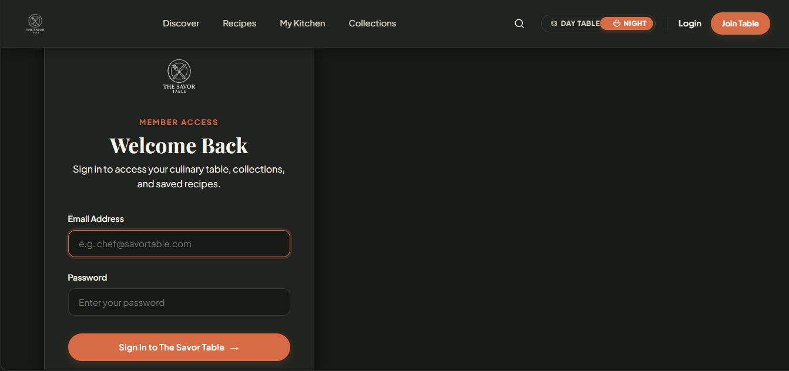
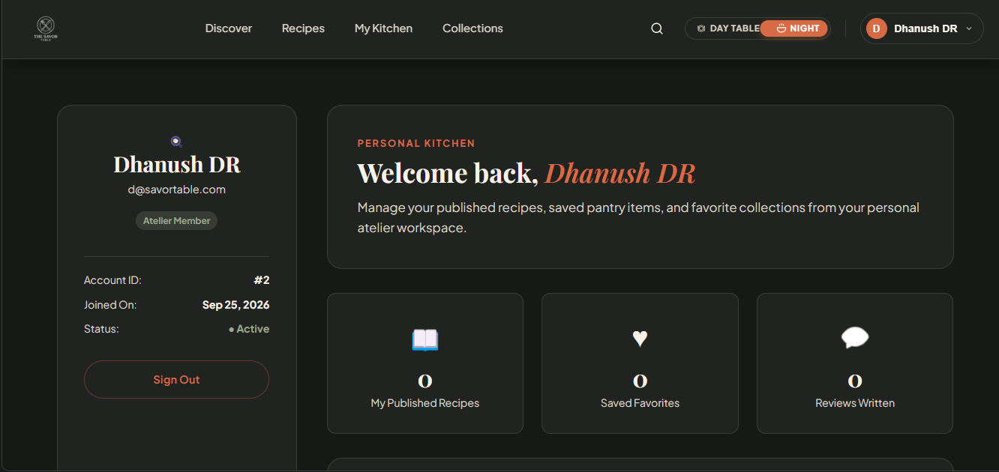

# THE SAVOR TABLE

**Project README / Reference Document**

## The Savor Table

A web-based Recipe Management System developed using Python, Flask, Flask-SQLAlchemy, SQLite, HTML5, CSS3, Vanilla JavaScript, and Jinja2. The application helps users discover recipes, manage recipes, save favorites, match recipes with available pantry ingredients, and follow recipes through a dedicated Cooking Mode.

The system provides recipe search, filtering, sorting, authentication, personalized collections, ingredient matching, responsive layouts, and a DAY TABLE / NIGHT TABLE theme system through a professional food-focused web interface.

---

## Features

- Recipe Discovery and Catalog Browsing
- Search by Recipe Title, Description, and Cuisine
- Category Filtering
- Cuisine Filtering
- Difficulty Filtering
- Recipe Sorting
- Recipe Details and Ingredient Display
- Recipe Instructions
- User Registration and Login
- Session-Based Authentication
- Secure Password Hashing
- Add Recipe
- Edit Recipe
- Delete Recipe
- Favorites / Save Recipe
- Personal Collections
- My Kitchen Pantry Ingredient Matching
- Ingredient Match Percentage
- Available and Missing Ingredient Display
- Cooking Mode with Step-by-Step Instructions
- Previous / Next Cooking Step Navigation
- DAY TABLE / NIGHT TABLE Theme Switching
- Responsive Multi-Page Interface
- Profile and Account Workspace
- SQLite Database Storage
- Authorization-Aware Recipe Management

---

## Tech Stack

### Frontend

- HTML5
- CSS3
- JavaScript
- Jinja2 Templates

### Backend

- Python
- Flask
- Flask-SQLAlchemy

### Database

- SQLite

### Authentication and Security

- Flask Sessions
- Werkzeug Password Hashing

### Version Control and Deployment

- Git
- GitHub
- Gunicorn
- Render

---

## Project Structure

```text
the-savor-table/
│── app.py
│── config.py
│── models.py
│── requirements.txt
│── README.md
│── database.db
│── test_favorites.py
│── .gitignore
│
├── screenshots/
│   ├── discover.png
│   ├── recipes.png
│   ├── recipe-details.png
│   ├── my-kitchen.png
│   ├── collections.png
│   ├── cooking-mode.png
│   ├── login.png
│   └── profile.png
│
├── static/
│   ├── css/
│   │   └── style.css
│   ├── js/
│   │   └── script.js
│   └── images/
│       ├── savor-table-logo.png
│       └── the-savor-table-logo.jpg
│
└── templates/
    ├── add_recipe.html
    ├── base.html
    ├── collections.html
    ├── cooking_mode.html
    ├── edit_recipe.html
    ├── index.html
    ├── login.html
    ├── my_kitchen.html
    ├── profile.html
    ├── recipe_details.html
    ├── recipes.html
    └── register.html
```

---

## Database Tables

The system uses SQLite to store user accounts, recipe information, ingredients, categories, favorites, and review-related data.

### User Table

| Field | Description |
|---|---|
| User ID | Unique user identifier |
| Name | User's name |
| Email | User email address |
| Password Hash | Securely stored password hash |
| Role | User role / authorization level |
| Created Date | User account creation date |

### Category Table

| Field | Description |
|---|---|
| Category ID | Unique category identifier |
| Name | Recipe category name |
| Created Date | Category creation date |

### Recipe Table

| Field | Description |
|---|---|
| Recipe ID | Unique recipe identifier |
| Title | Recipe title |
| Description | Recipe description |
| Image | Recipe image URL |
| Category ID | Related recipe category |
| Cuisine | Cuisine type |
| Preparation Time | Time required for preparation |
| Cooking Time | Time required for cooking |
| Servings | Number of servings |
| Difficulty | Recipe difficulty |
| Instructions | Cooking instructions |
| Author ID | User who created the recipe |
| Created Date | Recipe creation timestamp |
| Updated Date | Last update timestamp |

### Ingredient Table

| Field | Description |
|---|---|
| Ingredient ID | Unique ingredient identifier |
| Recipe ID | Related recipe |
| Name | Ingredient name |
| Quantity | Ingredient quantity |
| Unit | Measurement unit |

### Favorite Table

| Field | Description |
|---|---|
| Favorite ID | Unique favorite identifier |
| User ID | User who saved the recipe |
| Recipe ID | Saved recipe |
| Created Date | Date the recipe was saved |

### Review Table

| Field | Description |
|---|---|
| Review ID | Unique review identifier |
| User ID | User who submitted the review |
| Recipe ID | Related recipe |
| Rating | Recipe rating |
| Comment | Review comment |
| Created Date | Review creation date |

---

## Application Workflow

1. Open the Discover page.
2. Browse the recipe catalog.
3. Search for recipes when required.
4. Apply category, cuisine, difficulty, or sorting controls.
5. Open a recipe to view complete recipe information.
6. Register or log in to access personalized features.
7. Save recipes to Collections.
8. Open My Kitchen and enter available pantry ingredients.
9. View recipes ranked by ingredient match percentage.
10. Open a recipe in Cooking Mode.
11. Move through recipe instructions step by step.
12. Create, edit, or delete recipes according to authorization rules.

---

## Recipe Matching Workflow

```text
Pantry Ingredients
        ↓
Ingredient Normalization
        ↓
Recipe Ingredient Comparison
        ↓
Match Percentage Calculation
        ↓
Available / Missing Ingredients
        ↓
Matching Recipes Sorted by Percentage
```

---

## Favorites and Collections Workflow

```text
User Login
    ↓
Open Recipe
    ↓
Save Recipe
    ↓
Favorite Record Stored
    ↓
Collections
    ↓
View / Remove Saved Recipe
```

---

## Cooking Mode Workflow

```text
Recipe Instructions
        ↓
Instruction Parsing
        ↓
Individual Cooking Steps
        ↓
Step 01
        ↓
Next Step
        ↓
Step 02
        ↓
Next Step
        ↓
Step 03 ...
```

---

## API Integration

No external API is currently required for the core Savor Table application. The system operates using Flask routes, SQLite, and the application's own recipe data.

The main application flow is:

```text
User Request
     ↓
Flask Route
     ↓
Application Logic
     ↓
SQLite Database
     ↓
Jinja2 Template
     ↓
Rendered Web Page
```

---

## User Interface

The application interface includes:

- Fixed full-width navigation bar
- Discover homepage
- Savor Table branding and logo
- Recipe cards
- Search controls
- Category filters
- Cuisine filters
- Difficulty filters
- Sorting controls
- Recipe detail page
- Login and registration forms
- Profile page
- My Kitchen interface
- Collections page
- Cooking Mode
- Responsive layouts
- DAY TABLE / NIGHT TABLE theme system
- Food-focused visual design

---

## Installation

### 1. Clone or Download the Project

```bash
git clone https://github.com/DhanushDR-816/the-savor-table.git
cd the-savor-table
```

### 2. Create a Virtual Environment

```bash
python -m venv venv
```

### 3. Activate Virtual Environment — Windows

```bash
venv\\Scripts\\activate
```

### 4. Install Dependencies

```bash
pip install -r requirements.txt
```

### 5. Run the Application

```bash
python app.py
```

### 6. Open the Application

Open the following URL in your web browser:

http://127.0.0.1:5000/


## Screenshots

Place the actual project screenshots inside the `screenshots/` folder.

### Discover



### Recipes Catalog



### Recipe Details



### My Kitchen



### Collections



### Cooking Mode



### Login



### Profile



---

## Recipe Management

Users can create, view, update, and delete recipes according to the application's authorization rules.

Recipe records include:

- Recipe title
- Description
- Image
- Category
- Cuisine
- Preparation time
- Cooking time
- Servings
- Difficulty
- Ingredients
- Instructions
- Author information
- Creation and update timestamps

---

## Search, Filter and Sort

The recipe catalog supports:

- Search by title
- Search by description
- Search by cuisine
- Category filtering
- Cuisine filtering
- Difficulty filtering
- Sorting
- Clear Filters

The catalog displays all recipes by default when no filters are selected.

---

## Favorites and Collections

Logged-in users can save recipes to a personal collection.

The feature supports:

- Saving recipes
- Removing saved recipes
- Viewing saved recipes
- Opening saved recipes
- User-specific saved recipe records

---

## My Kitchen

My Kitchen allows users to enter ingredients available at home and find recipes that match those ingredients.

The feature:

- Accepts pantry ingredients
- Normalizes common singular/plural variations
- Compares pantry ingredients with recipe ingredients
- Calculates match percentage
- Displays available ingredients
- Displays missing ingredients
- Sorts matching recipes by percentage
- Excludes recipes with zero matches

---

## Cooking Mode

Cooking Mode provides a focused step-by-step cooking experience.

The feature:

- Converts stored recipe instructions into individual steps
- Displays the current cooking instruction
- Supports Next Step navigation
- Supports Previous Step navigation
- Displays the current step number
- Keeps the ingredient checklist available
- Provides a dedicated cooking interface

---

## Authentication

The application provides:

- User registration
- Duplicate email prevention
- Login and logout
- Session-based authentication
- Protected profile access
- Personalized features
- Password hashing
- Role-aware access

---

## Testing Checklist

- Homepage loads correctly
- Recipe catalog displays available recipes
- Search returns matching recipes
- Filters apply only selected filters
- Clear Filters returns to the full catalog
- Recipe details show complete recipe information
- Registration works
- Duplicate email prevention works
- Login and logout work
- Favorites can be saved and removed
- Collections displays saved recipes
- My Kitchen shows matching recipes and percentages
- My Kitchen handles singular/plural ingredient variations
- Cooking Mode displays different instruction content for each step
- Previous / Next navigation works
- DAY TABLE / NIGHT TABLE theme persists
- Responsive UI works across desktop and mobile layouts
- Recipe authorization rules are enforced

---

## Deployment

The application can be deployed as a Flask Web Service on Render.

### Build Command

```bash
pip install -r requirements.txt
```

### Start Command

```bash
gunicorn app:app
```

### Compute

```text
Free
```

### Environment Variables

No external environment variables are currently required for the core application.

### GitHub Repository

https://github.com/DhanushDR-816/the-savor-table

---

## Future Enhancements

- Recipe ratings and reviews expansion
- Shopping-list generation
- Recipe scaling by servings
- Personal cooking statistics
- Meal planning
- Image upload management
- Admin dashboard and moderation
- Expanded recommendation engine
- Persistent cloud database deployment
- Advanced personalized recipe recommendations
- Nutrition information
- Recipe sharing features

---

## Learning Outcomes

- Python programming
- Flask web application development
- SQLite database design
- SQLAlchemy ORM
- HTML and CSS
- JavaScript
- Jinja2 templating
- User authentication and sessions
- CRUD operations
- Form handling
- Database relationships
- Search and filtering
- Ingredient matching
- Responsive UI design
- Testing and debugging
- Git and GitHub
- Web application deployment

---

## Author

**Student Name:** Dhanush D R  
**USN:** U18IN24S0013  
**Course:** BCA  
**Project:** The Savor Table — Recipe Management System

**Technologies:**  
Python | Flask | SQLite | HTML | CSS | JavaScript | Jinja2 | SQLAlchemy

---

## GitHub

https://github.com/DhanushDR-816/the-savor-table

---

## License

This project is developed for educational, academic, internship, and portfolio purposes.
